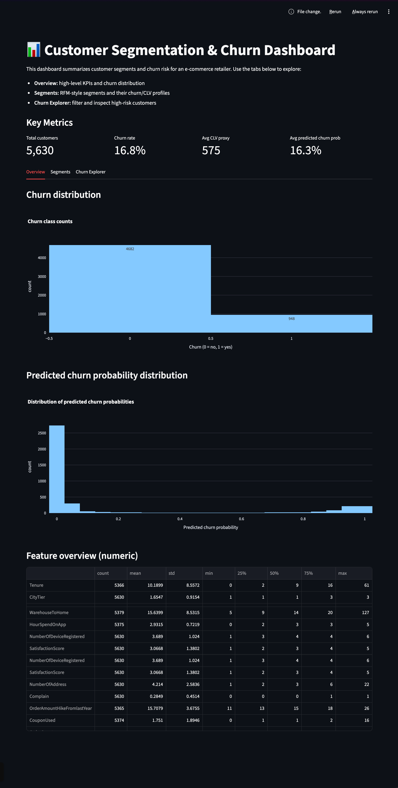
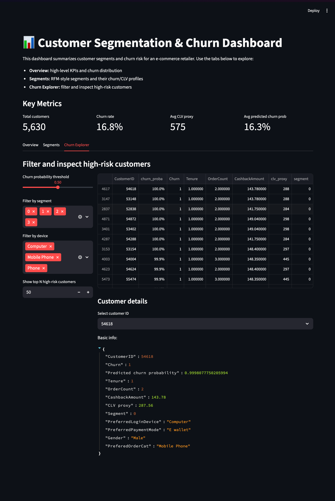

# Customer Segmentation & Churn Prediction Platform

An end-to-end **customer analytics solution** for an e‑commerce/retail business, combining  
**RFM-based customer segmentation**, **churn prediction modelling**, and an interactive **dashboard for insights & retention strategy**.

---

## 📌 Project Overview

Modern e-commerce businesses lose revenue when valuable customers churn. Retaining an existing customer is significantly more cost‑effective than acquiring a new one.  

This project builds a complete analytics system that enables a retailer to:

- Understand customer behavior  
- Segment customers into actionable groups  
- Predict likelihood of churn  
- Prioritize high-risk customers  
- Visualize KPIs in an executive-friendly dashboard

---

## 🚀 Features

### **1. Exploratory Data Analysis & Feature Engineering**
- Handles missing values, outliers, type corrections.
- Constructs behavioral features:
  - Recency, Frequency, Monetary (RFM)
  - Usage metrics, tenure, device patterns
  - Order trends, complaint history
  - CLV proxy score

### **2. Customer Segmentation**
- RFM normalization + K-Means clustering
- Elbow plot & silhouette analysis for optimal k
- Segment profiling:
  - High-value loyal customers
  - At-risk high spenders
  - Low-engagement customers
  - New users

### **3. Churn Prediction**
- Churn definition based on business rules.
- Models trained:
  - Logistic Regression
  - Random Forest
  - XGBoost (best model)
- Imbalanced data handled via class weighting
- Evaluation metrics:
  - ROC‑AUC, Precision, Recall, F1
- SHAP-ready pipeline for explainability

### **4. Interactive Dashboard (Streamlit)**
- KPI overview
- Segment analysis
- Churn Explorer:
  - High-risk filtering
  - Customer drill-down
- Business recommendation structure

---

## 📁 Project Structure

```
customer-analytics-churn-segmentation/
│
├── data/
│   ├── raw/               # Original dataset (xlsx)
│   ├── processed/         # Parquet + CSV transformed datasets
│
├── notebooks/
│   ├── 01_eda_and_feature_engineering.ipynb
│   ├── 02_segmentation.ipynb
│   ├── 03_churn_modelling_and_explainability.ipynb
│
├── src/
│   ├── data_prep.py
│   ├── clustering.py
│   ├── churn_model.py
│   ├── utils.py
│
├── models/
│   └── best_churn_pipeline.joblib
│
├── dashboard/
│   └── app.py             # Streamlit dashboard
│
└── README.md              # (this file)
```

---

## 📊 Dashboard Preview

```
screenshots/
    dashboard_home.png
    segment_analysis.png
    churn_explorer.png
```

Example in README:





---

## ▶️ Running the Project

### **1. Install dependencies**
```bash
pip install -r requirements.txt
```

### **2. Run feature engineering + models (optional)**
Open Jupyter:

```bash
jupyter lab
```

Execute the notebooks in order:
1. `01_eda_and_feature_engineering.ipynb`
2. `02_segmentation.ipynb`
3. `03_churn_modelling_and_explainability.ipynb`

This generates:

```
data/processed/churn_with_segments.parquet
models/best_churn_pipeline.joblib
```

### **3. Launch the dashboard**
```bash
streamlit run dashboard/app.py
```

---

## 📘 Business Insights

During analysis, key churn drivers typically include:

- Short tenure
- High complaint count
- Low satisfaction score
- Long gaps since last order
- Declining purchase frequency

Segments allow targeted retention strategies—for example:

| Segment | Risk | Strategy |
|--------|------|----------|
| High-value loyal | Low | Loyalty rewards, VIP access |
| At-risk high-value | High | Personalized retention offers |
| Low-engagement | Medium | Re-activation discounts |
| New customers | Variable | Onboarding & engagement nudges |

---

## 🧠 What I Learned

This project strengthened skills in:

- ML pipeline design  
- Feature engineering for behavioral data  
- Clustering evaluation  
- Model interpretability  
- Dashboard development for business stakeholders  
- End-to-end project structuring (EDA → model → deployment)

---

## 📝 License

MIT License. Free to use & adapt.

---

## 🙌 Acknowledgements

- Kaggle e‑commerce churn dataset  
- scikit-learn, XGBoost  
- Streamlit  